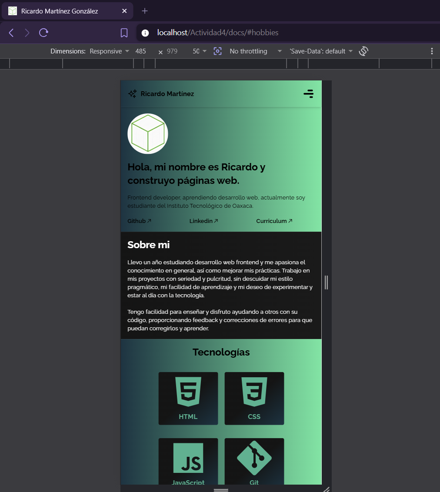
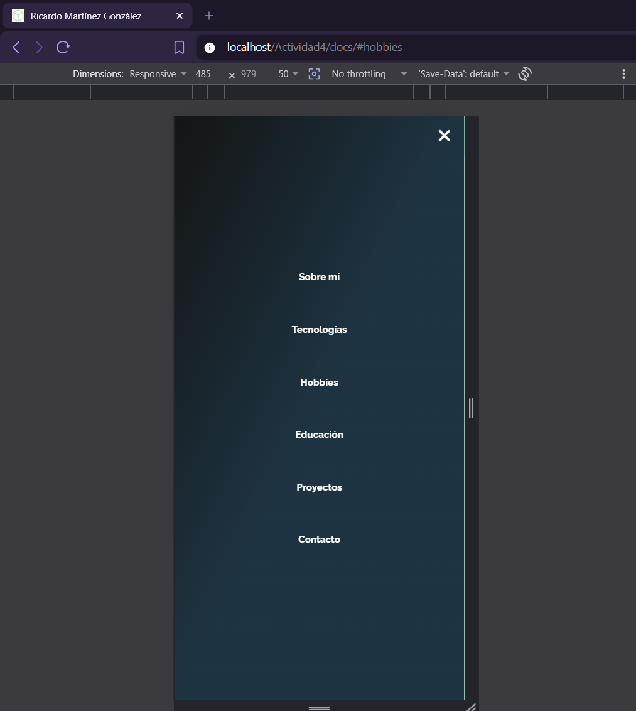
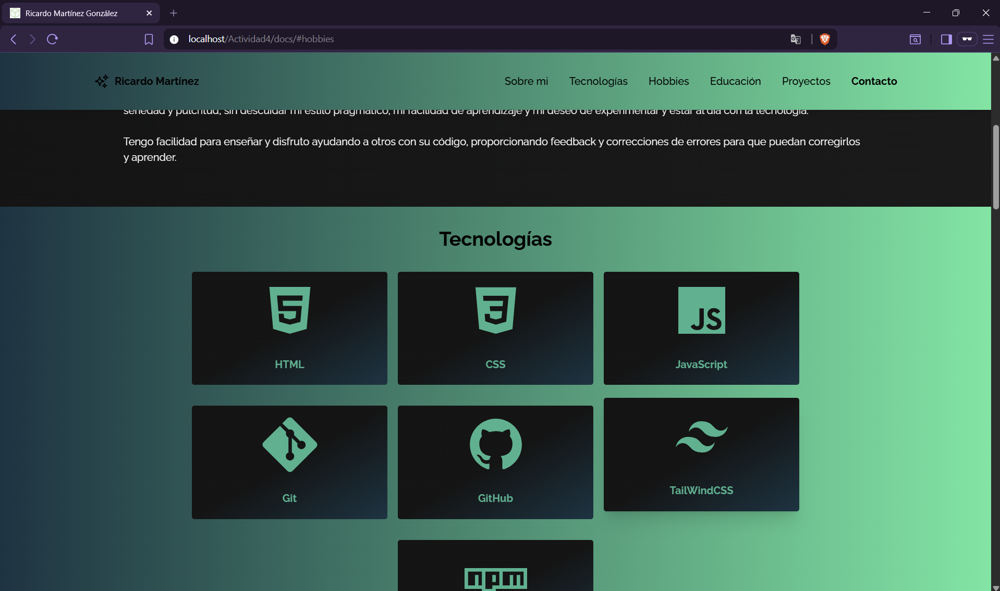

# Tooltips reutilizables

## Portada

# INSTITUTO TECNOLÓGICO NACIONAL DE MÉXICO
# INSTITUTO TECNOLÓGICO DE OAXACA

### **Carrera:** Ingeniería en Sistemas Computacionales
### **Materia:** Programación Web

### **Unidad 2:** HTML, XML Y CSS

### **Alumno:** Martínez González Ricardo  
### **Matrícula:** 23161012

### **Docente:** Adelina Martinez Nieto

### **Grupo:** 7SC  
### **Horario:** 10:00 – 13:00 hrs

---

## Actividad 4: Portafolio

Es un portafolio tomado de una diseño de figma y el código de el portafolio antiguo que tenía.

---

## Descripción del proyecto

Se utiliza el framework de Tailwind ya que te da más versatilidad al momento de utilziar los los estilos y te deja tener control total en estos.
El portafolio se divide en:
1. Header: Es una nabvar superior con position fixed donde puedes acceder a cada sección
2. Hero: Es donde está todo el contenido de la página
3. Sobre Mi: Es una breve descripción
4. Habilidades: muestra las habilidades o tecnologías que quiero dominar 
5. Hobbies: Hobbies que practico
6. Educacion: Sección de donde me eh formado
7. Proyectos: Proyectos pasados que he hecho
8. Contactos: Un formulario donde me pueden contactar

LINK DE LA PLANTILLA:
1. Diseño: https://www.figma.com/design/5Qe7uXMFAJshidmunnlCCW/Portafolio--Versi%C3%B3n-2023---Community-?node-id=0-1&p=f&t=37JDqXFSmWQdW0kb-0

2. Código: https://github.com/RMartinezGonzalez/Challenge-Portfolio-Oracle-One

## Proceso de creación
Descargué el portafolio que ya tenía, los cambios que hice fueron, cambiar algunos textos, el la sección de educación porner secciones genéricas, actulizar alguna fechas.

## Funcionamiento de página

### Mobile

---

### Desktop
